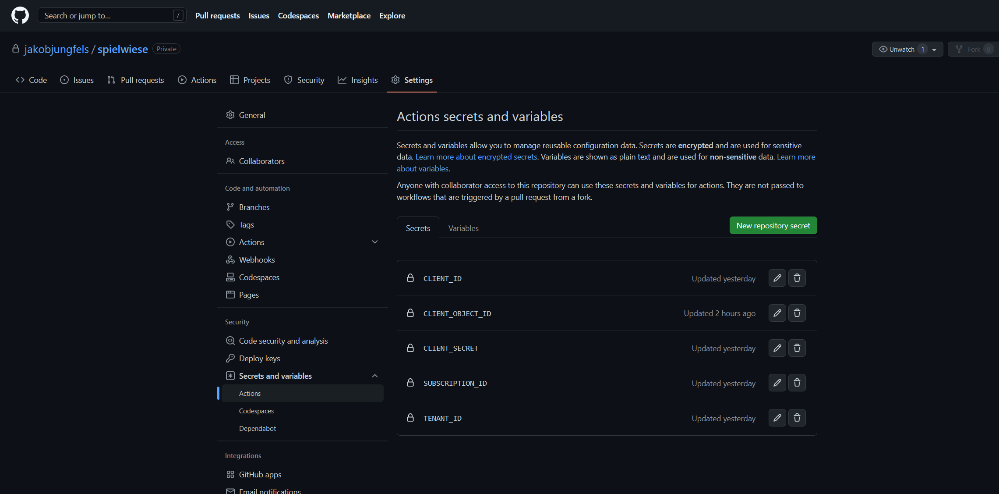

# spielwiese

The following steps need to be done manually. The rest of the deployment is handled via GitHub actions and ArgoCD

## GitHub setup

Create service principle

```shell
az login
az account set --subscription <sub_id>
az ad sp create-for-rbac --name kubernetesPrincipal --role Contributor --scopes /subscriptions/<sub_id>
az ad sp list --display-name "kubernetesPrincipal" --query '[].{""Object ID"":objectId}' --output table
```

To login using the service principle

```shell
az login --service-principal -u <app_id> -p <principle_password> --tenant <tenant_id>
```

Create GitHub secrets



## Azure setup

Create terraform state storage

```shell
cd spielwiese\globalstatestorage
terraform init
terraform plan
terraform apply -auto-approve
```
